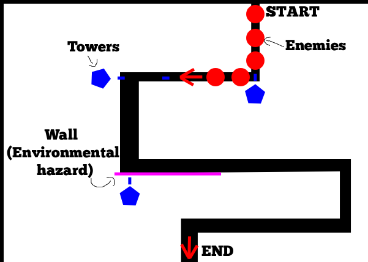
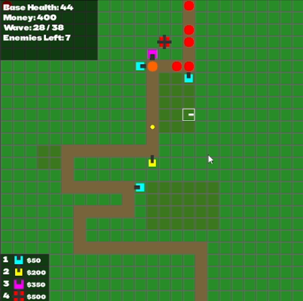
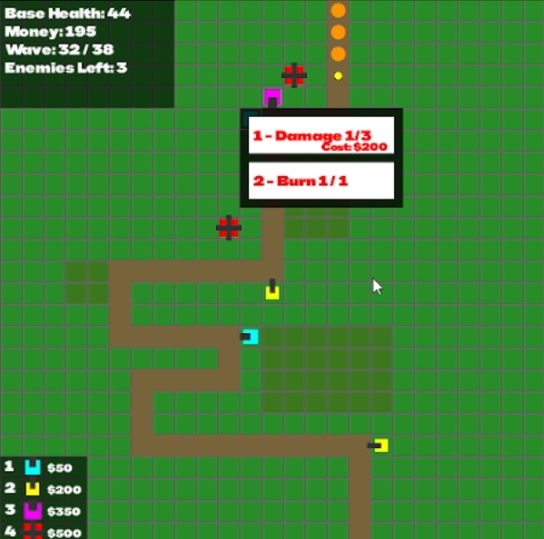
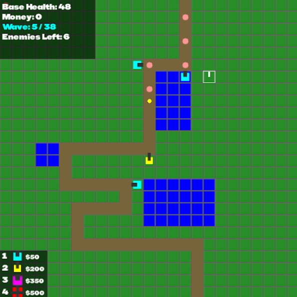

# Tower Defence Game

A C++ and SDL2-based tower defence game using object-oriented programming and real-time game logic.
This report provides a concise overview of the game and its development process.

# Video Link
https://youtu.be/sp-2pJSsx4Y

# Gameplay Description

The player must defend their base from waves of incoming enemies that follow the path.
Towers can be placed on the grid to attack enemies before they reach the end of the path. Each tower has unique stats and upgrades

Basic Tower: Low damage, moderate range, burn upgrade.

Long-Range Tower: Extended range, piercing projectiles upgrade.

Heavy Tower: High damage, slower fire rate, slow effect upgrade.

Four-Way Tower: Fires in all directions simultaneously.

Enemies come in different types (small, medium, large) with differing health and speed.
Every 5 rounds, a special wave occurs that activate flood areas within the map, disabling any towers placed in these areas.

# Dependencies Used
These must be added or reference to build and run the game:

1. SDL2 (2.28.2)

Include Directory: Add the include folder from SDL2 to the project’s Additional Include Directories.
Example: C:\SDL2\include

Library Directory: Add the lib folder from SDL2 to Additional Library Directories.
Example: C:\SDL2\lib\x64

Linker Input: Add SDL2.lib and SDL2main.lib to Additional Dependencies under Linker → Input.

Runtime DLL: Copy SDL2.dll to the folder containing the compiled .exe.

2. SDL_ttf (2.22.0)

Include Directory: Add the include folder from SDL_ttf to Additional Include Directories.

Library Directory: Add the lib folder from SDL_ttf to Additional Library Directories.

Linker Input: Add SDL2_ttf.lib to Additional Dependencies.

Runtime DLL: Copy SDL2_ttf.dll to the folder containing the compiled .exe.

3. Fonts

Ensure BBHSansHegarty-Regular.ttf is placed in the same folder as the executable

4. Wave Data

Include waveData.txt in the project directory

# Use of AI During Development

AI tools were used as a coding assistant throughout the project, helping with tasks such as:

- Automate repetitive code tasks (like SDL rendering boilerplate).

- Debug subtle logic issues (e.g. projectile spawning and enemy erasure).

- Speed up development once the project scaled in size.

All core gameplay logic, design, and implementation decisions were completed manually — AI served mainly for code suggestions and debugging support.

# Game Programming Patterns Used

Object-oriented Programming:
Enemy, Tower, Projectile, Wave, and Game has its own class.

Inheritance and Polymorphism: 
Enemies derive from a base Enemy class (smallEnemy, mediumEnemy, largeEnemy).
Towers extend the Tower base class (basicTower, longRangeTower, heavyDamageTower, fourWayTower).

Factory Pattern: 
The Wave class spawns enemies using smart pointers.

# Game Mechanics and Implementation

Enemy Movement: Enemies follow a pre-calculated path via arrays of X/Y coordinates.

Tower Targeting: Towers check range and fire at enemies using a fire-rate tick counter.

Projectile Logic: Each projectile tracks its own range, speed, and effects (burn, slow, pierce).

Wave Management: The Wave class spawns enemies at set intervals until complete.

Damage Handling: Enemies lose health on hit; if health drops to zero, they are removed and the player gains currency.

# UML Design Diagram

# Sample Screens
Gameplay:

Tower Upgrades:

Special Waves:

# Exception Handling and Testing

Defensive coding practices were used throughout:

Initialization checks: Verifies SDL, window, and fonts load correctly before running the game loop.

Safe memory handling: Uses std::unique_ptr for automatic cleanup.

Bounds protection: Enemy and projectile loops include range checks to prevent invalid access.

Manual testing: Edge cases tested, such as simultaneous enemy deaths and projectiles expiring.

Console logging: Used for tracing game state and verifying expected behavior.

# Further Technical Details

The game loop consists of:
Input() → Logic() → Render()

Input():
- Cursor movement and rotation

- Placing, upgrading and deleting towers

- Starting new waves

Logic():
- Tower firing and cooldowns

- Projectile movement and collision detections

- Enemy movement and damage

- Wave spawning 

- Environmental effects

- Player stats management

Render():
- Draw game grid, path, enemies, towers, and projectiles

- Render HUD elements, including controls and player stats

- Display tower upgrades and prices

- Visual feedback effects

# Evaluation and Reflection

A fully working object-oriented C++ game tower defence game, using SDL2 for rendering. 
Features functioning towers, upgrades, enemies, and map elements

What could improve:

- More tower and enemy types with unique abilities.

- Smoother enemy movement and tower targeting.

- Saving feature to leave mid-game.

- Win end game screen.

